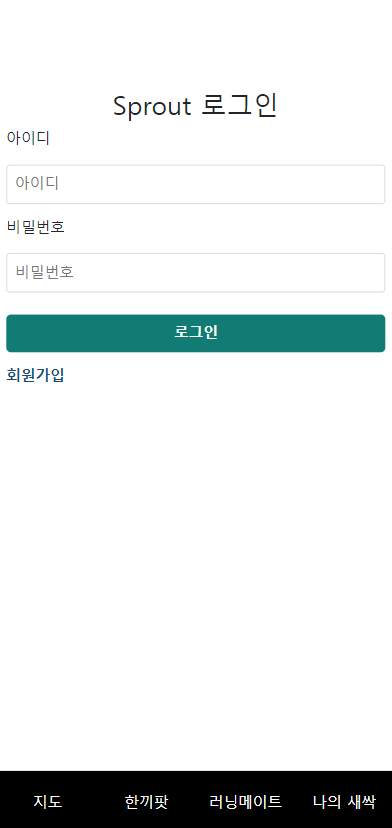
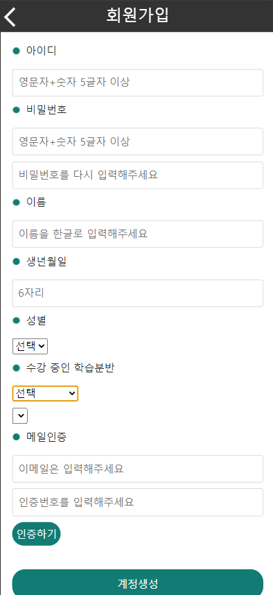
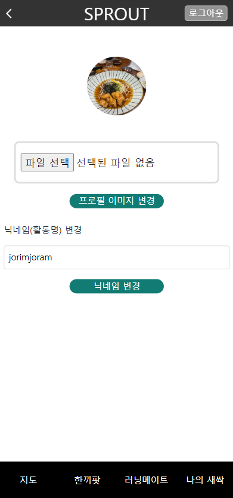
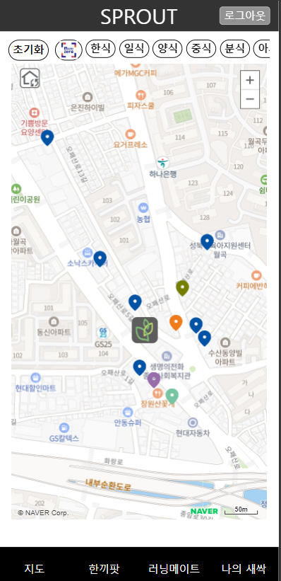
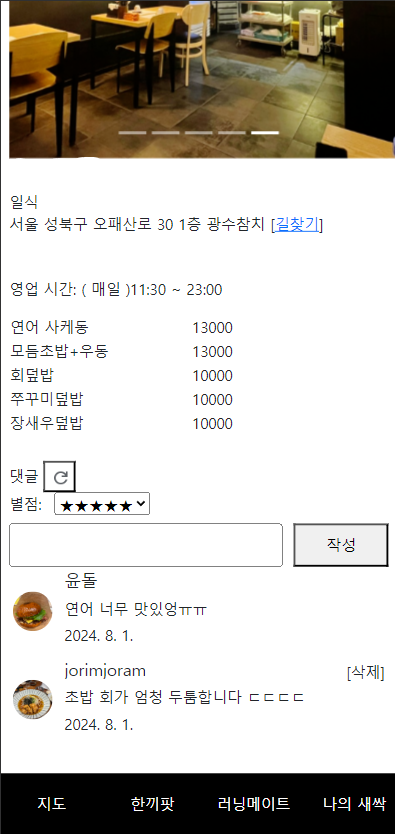

# Readme.md

# SPROUT

## 설명

**캠퍼스 주변 맛집을 지도로 시각화하고, 필터링 및 익명 커뮤니티 기능을 제공하여 학생들이 편리하게 맛집을 찾고 함께 식사할 사람을 구할 수 있도록 지원하는 웹 서비스입니다.**

저희가 웹 서비스를 기획하고 제작하게 된 배경은 다음과 같습니다.

**1. 왜 우리보다 앞선 교육 기수는 낯선 이곳의 정보를 남겨두지 않고 떠났는가!**

청년취업사관학교 성북 캠퍼스 교육생의 대부분은 캠퍼스 주변 동네에 대해 잘 알지 못해, 교육이 시작되면서 점심 식사를 해결하는 데 어려움을 겪었습니다. 저 또한 캠퍼스를 관리하는 여러 매니저님들을 통해 정보를 얻어 리스트업을 했지만, 단순한 엑셀 표보다는 지도를 이용해 시각화하면 교육생들에게 더 편리하게 정보를 제공할 수 있겠다고 생각했습니다. 특히, 여러 포털사이트 지도에서도 보이지 않는 숨은 식당들이 많기 때문에, 실제로 이용한 교육생들의 이야기를 남겨 다음 기수가 참고하면 의미 있는 프로젝트가 될 것 같아 시작하게 되었습니다.

**2. 서먹한 교육 초기의 우리, 더 가까워질 수 있게!**

식사는 단순히 밥을 먹는 행위 이상으로, 다른 교육생들과 진솔한 이야기와 인사이트를 나눌 수 있는 중요한 시간입니다. 교육생들의 배경과 도메인이 다양하기 때문에, 그 시간에 나누는 이야기나 정보들은 매우 중요합니다. 하지만, 교육 초기에는 다른 교육생들에게 다가가는 것이 쉽지 않습니다. 이를 위해 웹 서비스 내에 닉네임으로 식사를 같이할 사람들을 모으고, 댓글을 통한 소통 창구를 마련하여 교육생들이 서로에게 더 쉽게 다가갈 수 있도록 기능을 추가했습니다.

**3. 반응형 웹을 통해 모바일에서 더 편리하게!**

교육생들은 모두 휴대폰을 이용해 아침마다 출석 체크를 합니다. 하지만 각 교육생이 사용하는 휴대폰의 기종과 OS가 다르기 때문에, 모두가 사용할 수 있도록 웹 환경에서 설계했습니다. 또한, 메인 기능 중 하나인 지도 시각화를 모바일 환경에서 더 쉽게 사용할 수 있도록 반응형 웹으로 구현하여, 교육생이 모바일 환경에서도 편리하게 이용할 수 있도록 했습니다.

## 이미지

    
    
    

    
    
    

## 메인 기능
### 회원가입 및 로그인
- 정보 검증: 교육생의 아이디와 비밀번호를 정규표현식을 통해 검증합니다.
- 이메일 인증: 이메일 인증을 통해 본인 확인을 진행합니다.
- 비밀번호 보안: Spring Security의 BCrypt 알고리즘을 사용하여 비밀번호를 단방향 암호화하여 저장합니다.
- 접근 제한: 로그인한 교육생만 성북캠퍼스에서 서비스를 사용할 수 있습니다.
### 지도 내 마커 시각화 및 필터링
- 마커 시각화: 네이버 지도 API를 이용해 캠퍼스 주변 가게들을 마커로 표시합니다.
- 필터링 기능: 제로페이 사용 가능 여부 및 가게 유형별 필터링 기능을 추가하여 사용자 편의성을 높였습니다.
### 식당 콘텐츠 및 길찾기
- 가게 정보 조회: 마커를 통해 가게의 상세 정보를 조회할 수 있습니다.
- 이미지 캐러셀: 여러 음식과 규모를 이미지로 확인할 수 있는 캐러셀 기능을 제공합니다.
- 식당 이미지: 각 식당별로 식탁 구성이나 크기를 보여주는 이미지를 엄선했습니다.
- 길찾기 연동: 네이버 지도 앱과 연동하여 가게 위치를 확인하고 길찾기를 제공합니다.
### 한끼팟
- 커뮤니티 형성: 교육생들이 식사 전에 모임을 만들 수 있는 커뮤니티입니다.
- 닉네임 사용: 닉네임을 통해 교육생들 간의 친밀감을 높입니다.
- 소통 기능: 댓글과 참여 버튼을 통해 서로 소통하고 함께 식사할 수 있는 자리를 만듭니다.

## Stack
- **Language**: Kotlin, JavaScript(Vanilla)
- **Library & Framework**: Spring boot(3.1.5), Axios, Bootstrap
- **DataBase**: MariaDB
- **ORM**: hibernate
- **Deploy**: PortForwarding을 통한 개인 컴퓨터

## Server Architecture
(이미지 잘 만드십쇼)

## Developer
- 강윤석(기획 및 프로젝트 총괄)
- 장효림(Full Stack 개발 및 구현)
- 정선영(페이지 프레임 설계 및 기획)
- 노희진(컨텐츠 기획)
- 이민지(컨텐츠 기획 및 UI 일부 설계)
- 오수연(UI 및 UX 설계)